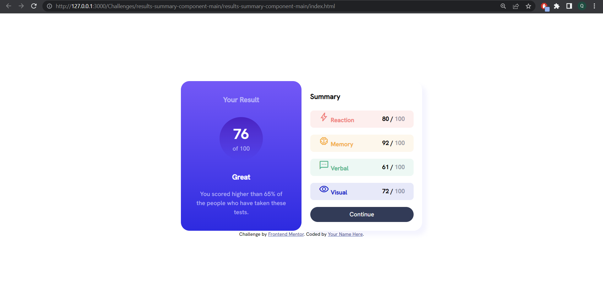

# Frontend Mentor - Results summary component solution

This is a solution to the [Results summary component challenge on Frontend Mentor](https://www.frontendmentor.io/challenges/results-summary-component-CE_K6s0maV). Frontend Mentor challenges help you improve your coding skills by building realistic projects. 

## Overview

### The challenge

Users should be able to:

- View the optimal layout for the interface depending on their device's screen size
- See hover and focus states for all interactive elements on the page

### Screenshot

### Links

- Solution URL: [Add solution URL here](https://github.com/RaidEyes/2nd-challenge-result-summary-card)
- Live Site URL: [Add live site URL here](https://your-live-site-url.com)

## My process

### Built with

- Semantic HTML5 markup
- CSS custom properties
- Flexbox
- CSS Grid
- Mobile-first workflow

### What I learned

_I have learned so much about the grid and the flex box system. At first I thought I should choose only one to use but then I realized I could combine these 2 for a much better result.

_ I used to scared of media querry but now I have completed this challenge in less than 1 day. I'm very proud of myself.

### Continued development

_ Although I'm very familiar with CSS and HTML now, I still need more challenges to strengthen these guys. I will do at least 5 more challenges before I add my JS.

